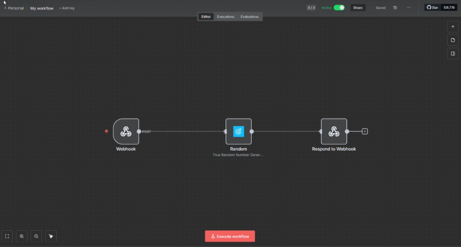

## Tecnologias Usadas

- **n8n**: Plataforma de automação de workflows.
- **Node.js**: Ambiente de execução JavaScript para backend.
- **TypeScript**: Superset do JavaScript que adiciona tipagem estática.
- **Docker & Docker Compose**: Containerização e orquestração do ambiente.
- **PostgreSQL**: Banco de dados utilizado pelo n8n.
- **Gulp**: Automatização de tarefas (cópia de ícones).
- **HTML**: Interface auxiliar para geração de dados.

## Passo a passo para rodar o projeto
1. **Instale o Docker Desktop:**
	- Baixe e instale o Docker Desktop para Windows ou Mac a partir de: https://www.docker.com/products/docker-desktop
	- Para Linux, siga as instruções oficiais: https://docs.docker.com/engine/install/

2. **Verifique a instalação do Docker Compose:**
	- Após instalar o Docker Desktop, o Docker Compose já estará disponível.
	- Para verificar, execute no terminal:
	  ```sh
	  docker-compose --version
	  ```
	- Você deve ver a versão instalada do Docker Compose.

3. **(Opcional) Instale Docker Compose manualmente no Linux:**
	- Se necessário, siga: https://docs.docker.com/compose/install/


4. **Clone o repositório:**
	```sh
	git clone https://github.com/lucasfraga6654Teste_n8n_OnFly.git

	```

5. **Instale as dependências:**
	```sh
    npm install -g typescript
	npm install -g n8n
	```

6. **Compile o projeto e suba o Docker :**
   - Você deve estar dentro da TesteN8n_Onfly
	```sh
   docker-compose up -d --build
	```

7. **Configure o n8n para usar o node custom:**
	- Adicione a variável de ambiente no seu n8n principal:
	  ```
	  N8N_CUSTOM_EXTENSIONS=Caminho\absoluto\para\n8n-nodes-random\dist
	  ```
	- Exemplo para Windows:
	  ```
	  N8N_CUSTOM_EXTENSIONS=C:\Users\seu-usuario\caminho\para\n8n-nodes-random\dist
	  ```


	


8. **Acesse o n8n:**

	[http://localhost:5678](http://localhost:5678)

10. **Faça o login e importe o workflow**


<div align="center">
	
</div>

- No canto superior direito clique no botão vermelho "Create Workflow"

<div align="center">
	
</div>

- No canto superior direito clique no botão de Três pontos, após isso clique em "Import from file"

<div align="center">
	
</div>
- Dentro da pasta Principal do projeto (TESTEN8N_ONFLY) você encontrará o arquivo "Randow_workflow.json" abra-o dentro do N8n.

<div align="center">
	
</div>

- Faça questão que a função "Share" está ativada, o botão do tipo Slide deve estar verde no canto superior direito ao lado esquerdo da palavra "Share"

<div align="center">
	
</div>

11. **Abra a interface e a utilize**

- Dentro do projeto há um arquivo html chamado "Gerador.html". Abra-o.

<div align="center">
	
</div>

- Digite os números nos campos

<div align="center">
	
</div>

- Clique no botão "Gerar Número"

<div align="center">
	
</div>


## Estrutura de Pastas do Projeto

```
TesteN8n_OnFly/
├── docker-compose.yml         # Arquivo de configuração do Docker Compose para subir o ambiente n8n
├── Dokerfile                  # Dockerfile para build customizado (se necessário)
├── Gerador.html               # Página HTML auxiliar (ex: geração de dados)
├── Imagens/                   # Imagens usadas no README ou documentação
├── n8n-nodes-random/          # Pacote do node custom
│   │   
│   │   
│   ├── gulpfile.js            # Script para copiar ícones após o build
│   ├── nodes/                 # (pasta reservada, pode estar vazia)
│   │ 
│   ├── package.json           # Configurações do projeto e scripts npm
│   ├── src/                   # Código-fonte do node custom
│   │   └── index.ts           # Ponto de entrada do pacote custom
│   │   └── nodes/Random/      # Implementação do node custom e ícones SVG/PNG
│   │       ├── Random.node.ts # Código principal do node custom
│   │       └── logo_onfly.svg # Ícone SVG do node custom
│   │       
│   └── tsconfig.json          # Configuração do TypeScript
├── Randow.json.json/          # (pasta vazia ou para testes)
├── Randow_workflow.json       # Workflow para importar no n8n
├── README.md                  # Documentação do projeto
└── ...                        # Outros arquivos auxiliares
```

### Descrição dos principais arquivos/pastas
- **docker-compose.yml**: Sobe o ambiente n8n com Docker.
- **Dockerfile**: (Opcional) Build customizado de container.
- **Imagens/**: Imagens usadas na documentação.
- **n8n-nodes-random/**: Todo o código do seu node custom.
	- **src/**: Código-fonte TypeScript do node custom.
	- **dist/**: Código compilado e ícones prontos para uso pelo n8n.
	- **gulpfile.js**: Script para copiar ícones após build.
	- **package.json**: Configurações, dependências e scripts npm.
	- **tsconfig.json**: Configuração do TypeScript.
- **Randow_workflow.json**: Exemplo de workflow para importar no n8n.
- **README.md**: Documentação e instruções do projeto.


